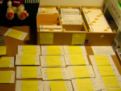

<!-- 1. headers should always have beg images
     2. Small paragraphs of 2 to 3 sentences
     3. Stylize the words to assist and enlist chunking.
     4. The About should be concise CV
     5. Use feeling and pain-a-picture words instead of academic words
     6. Since this is a git porfile readme never list your popular git repos as github, gitlab, and bitbucket wil do that automatically for your profile page added headers. Instead list your git cloud repos is more than one.
     7. Refrain from adding collapsible content as your git repo profile page is not suppose to be that lengthy long and boring.
     8. Put a 1-2-sentence summary of your personal manifesto in the About block as a blockquote.

     Note: md processors can process liquid tags so I need to play with liquid tags and see what I can use.
-->
#   Fred Grott's Readme

I created this personal **README** document to help you get to know me and how I work. This document acknowledged:

*[Matej's README](https://gitlab.com/matejlatin/focus#matej-readmemd)

*[Tim Hey's README](https://about.gitlab.com/handbook/product/readme/tim-hey.html)

*[Matias Singers' Currated Awesome README List](https://github.com/matiassingers/awesome-readme)

##  My Git Repo Cloud Profiles

*[Bitbucket Profile](https://bitbucket.org/fredgrott/)

*[Github Profile](https://github.com/fredgrott)

*[Gitlab Profile](https://gitlab.com/fred.grott)

### Projects Of Note

##  About Fred Grott
>Developing and Designing an App is *not Programming a Computer* **but Programming a Human**

**I am the crazy SOB** that started an innovation studio, [Innovation Studio Name]() during the **COVID pandemic**.

I write about mobile app development, design, and life at my [Medium Profile](https://medium.com/@fredgrott). My slides on mobile app design, development, maniefestos, and life at my **[SpeakerDeck Profile](https://speakerdeck.com/fredgrott)**. And, I am also starting a youtube channel, [DesignHacking](https://www.youtube.com/channel/UCBRREUKFNWIELQ3oBzeXiMA)

I am **self-publishing** some books on app development and design and at some point I will be creating a series of video courses on mobile app development. You can keep track and get the announcement when the book and videos come out at **[my personal website](https://fredgrott.github.io)**.

I contribute to Flutter and Dart Community Plugins including the **[Flutter Platform Widgets Plugin@Github](https://github.com/aqwert/flutter_platform_widgets)**.

##  How I Work
**Sorry, I do not work :tent: your way**. After suffering decades with uncontrolled **ADD form of ADHD**, I developed my own modified workflow system based on **cognitive science** and **applied cognitive pyschology**. It fits the chaos in my head while at the same time adjusts to my own deep focus spurts when I get passionately interested in something.

##  How To Reach Me
>**Do Not Be A Dick**! I do not answer inquires from recruiters or dev-design shops inquiring to use their services. Individual dev or designer questions are at  flutter subject area forums of **stackoverflow**([Flutter](https://stackoverflow.com/tags/flutter)) or **reddit**([FlutterDev](https://www.reddit.com/r/FlutterDev/)).

You can contact me at **fred** DOT **grott** AT **gmail** DOT **com** or you can **DM at my [Keybase Profile](https://keybase.io/fredgrott)**. I can be also DM at my [Discord Profile](https://discordapp.com/users/9388/) or at my [fluttercommuity slack profile](https://fluttercommunity.slack.com/UHK8PNRGU).

Keep in mind that most developers and designers prefer to not  interrupted for  blocks of time as that they need that focus time to work on code or digital design work thus do not expect that I drop everything to respond to you. I will get to it if it's important when I get to it.
